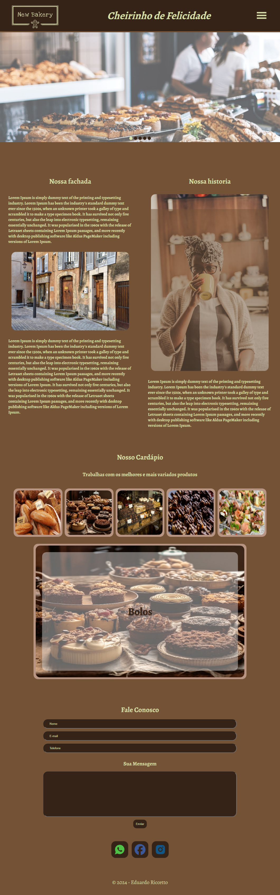

Clique aqui para alterar o idioma:

 

# Bakery

O projeto Bakery é uma landing page desenvolvida com foco em uma experiência de usuário moderna e visualmente atraente, utilizando as melhores práticas de desenvolvimento web. A aplicação foi construída com React, garantindo uma interface dinâmica e responsiva, em conjunto com styled-components para estilização, oferecendo um design sofisticado e customizado.  O objetivo principal da Bakery é criar uma plataforma interativa e visualmente impactante para uma padaria, destacando seus produtos e serviços de maneira intuitiva e acessível. A aplicação integra ícones modernos por meio da biblioteca react-icons e utiliza o react-scroll para proporcionar uma navegação suave entre as seções da página, otimizando a usabilidade e a fluidez da experiência.  Uma funcionalidade adicional importante é o sistema de notificações personalizadas utilizando a biblioteca sonner, que oferece feedback instantâneo e amigável para os usuários, como ao enviar mensagens de contato.  O projeto foi desenvolvido utilizando Vite para uma experiência de desenvolvimento rápida e eficiente, além de boas práticas de código com suporte a TypeScript e ESLint, garantindo maior segurança e qualidade no desenvolvimento.

:computer: [Clique aqui para acessar a aplicação](https://bakery-ten-eta.vercel.app/)

## Tecnologias

## Tecnologias Secundárias

## Dependencias

- @types/styled-components
- react
- react-dom
- react-icons
- sonner
- styled-components

## Começando

Este projeto pode ser usado em sua própria máquina após realizar um **PUSH** deste repositório.

### `npm install`

Para baixar e atualizar todas as bibliotecas e dependências do projeto

### `npm start`

Executa aplicativo em modo desenvolvimento.\
Abra [http://localhost:5173/](http://localhost:5173/) para vizualizá-lo em seu navegador.

A pagina será recarregada quando você fizer alterações.\
Você também pode ver quaisquer erros de lint no console.

## Contato

  
   
  
   

    